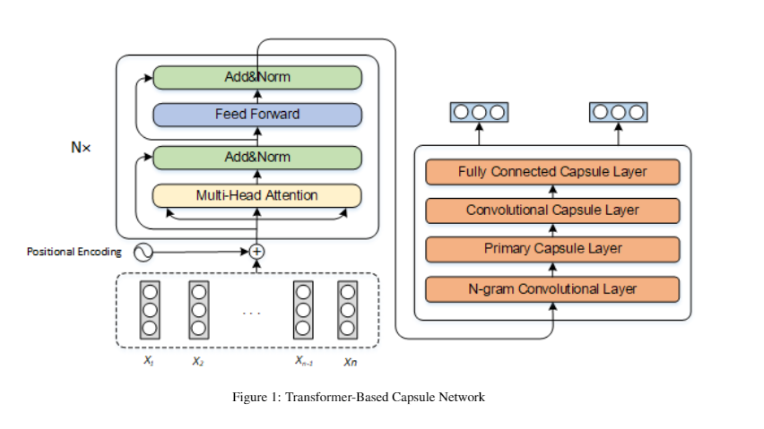

# Transformer-Based Capsule Network For Stock Movements Prediction

我们提出了一个基于Transformer Encoder的胶囊网络模型，该模型使用Transformer编码器提取社交媒体的深层语义特征，然后通过胶囊网络捕获文本的结构关系。  

文章出处：IJCAI  
缺点：没有添加基本面的数据，没有比金融模型进行关联，文章有点水

# HATS: A Hierarchical Graph Attention Network for Stock MovementPrediction

# DoubleEnsemble: A New Ensemble Method Based on Sample Reweighting and Feature Selection for Financial Data Analysis  
文章出处：CCF-B  
金融上的问题具有高噪声、可预测性较弱等特点，因此很多目前在图像、自然语言等方面效果较好的方法在金融数据的分析和预测上都很难取得令人满意的效果。我们从机器学习的角度，提出使用集成模型方法（ensemble）解决这样的问题。在机器学习领域，集成模型的方法具有对于噪声稳定、不易于过拟合、相对于基模型有更强的模型容量等特点。我们的模型是基于金融中的多因子模型，该模型比较贴近机器学习里面的有监督学习（即，抽取大量的特征和标签，然后拟合训练数据集）；  
把输入数据 X 看做一个矩阵，其每一行代表一个样本，每一列代表一个特征。以往的一些集成模型方法有在这两个维度上来采样或者加权来构建每个子模型：比如 bagging 类方法会在构建子模型的时候随机采样若干“行”；而 GBDT 类模型在构建子模型的时候会随机采样若干“列”（比如 XGBoost 里面的 colsample_byxxx）。我们的集成模型在构建每个子模型的时候不仅给不同的“行”分配不同的权重，并且也随机筛选出不同的“列”；并且，我们的筛选/加权是基于各个特征/样本在训练中的表现来进行的，这种方式能够更有效地保留重要的特征/减小噪声样本的权重。

想法：基于多因子模型，融合金融的知识。不过使用的模型比较简单，因子不是很全   

# Forecasting stock prices with long-short term memory neural network based on attention mechanism
基于LSTM和注意力机制，利用小波变换对历史股票数据进行去噪，提取和训练其特征，建立股票价格预测模型。  
特点:Wavelet transform  
不足：做的金融相关的东西还是需要和金融模型的结合更加紧密一些，发掘一些机器学习模型和金融模型更加内在的联系，而不是直接把金融的过程作为一个黑盒子然后直接套用现成的机器学习方法。  
只考虑历史数据，没有考虑其他的因子，基本面  
文章出处：2区
> Qiu J, Wang B, Zhou C. Forecasting stock prices with long-short term memory neural network based on attention mechanism[J]. PloS one, 2020, 15(1): e0227222.

# Autoencoder asset pricing models
文章出处：顶刊  
这篇文章把定价模型（asset pricing model）和机器学习中的 autoencoder 相互联系起来，并且构建了一个具有一定量化金融含义的机器学习模型。    
优点：金融模型与ml模型进行联系    
知乎：https://zhuanlan.zhihu.com/p/143853032
> Gu S, Kelly B, Xiu D. Autoencoder asset pricing models[J]. Journal of Econometrics, 2020.

